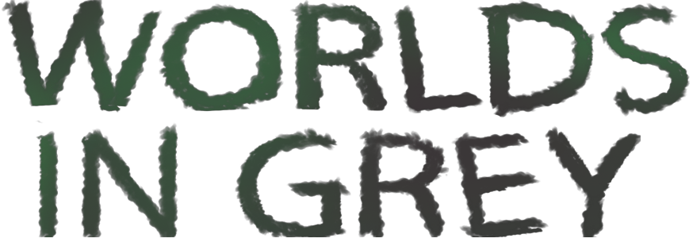

<hr>

# 🌱 Worlds in Grey
Worlds in Grey is an educational puzzle-platformer developed for PC using Unity, designed to advocate for climate action in support of SDG 13. Set in a post-apocalyptic world devastated by human neglect, the game follows a robot named T3rr4 who journeys through five distinct environments—ranging from ruined forests to polluting factories—to solve puzzles and plant vegetation, transforming the "grey" world back into a colored, living ecosystem. The narrative emphasizes environmental stewardship, culminating in T3rr4's self-sacrifice to fully restore the Earth's ecological balance and save the remaining life on the planet.

## 🎮 Game Features
- **Genre:** Educational Puzzle-Platformer
- **Setting:** Post-Apocalyptic World
- **Visual Mechanic:** Dual-State Environments (Grey vs. Colored)
- **Level Structure:** 5 Distinct Levels (Forest, City, Factory, Underground)
- **Controls:** Walking, Jumping, and Interacting
- **UI Elements:** Energy Bar System

## 🚀 Quick Start

### The pre-built binaries
Navigate to [Releases](https://github.com/Brurur/Worlds_In_Grey_Official/releases) page to download the pre-built binaries.

### Prerequisites

- Unity v6000.0.57f1 (or higher)

### Installation

1. **Clone the repository**
   ```bash
   git clone https://github.com/Brurur/Worlds_In_Grey_Official.git
   cd Worlds_In_Grey_Official
   ```

2. Open the project in Unity Hub
3. Open `Main Menu` scene under `Assets/Scenes`
4. Hit the start button to preview the game in development mode

## 🏗️ Build the game's binary

1. Open the project in Unity Hub
2. Click `File` on the menu bar (on top-left) > `Build Profiles`
3. Choose preferred platform to build (PC only)
4. Hit `Build` button and choose preferred folder for the game output

## 🎯 How to Play

1. **Start the Game** - Click the play button on the main menu
2. **Solve the puzzle** - Each level has different puzzle; solve it to finish the game! 
3. **Reach the End** - Finish all puzzles to bring the colored world!

## 🎨 Assets & Credits

All visual assets including character illustrations, game elements, and UI elements are original artwork created by our talented illustrator. These assets are protected by copyright and are exclusive to this project. Reusing assets require explicit permission from us (Read more in [LICENSE](LICENSE) file for details)

## 🤝 Contributing

We welcome contributions! Please feel free to submit a Pull Request. For major changes, please open an issue first to discuss what you would like to change.

## 📝 License

- **Code**: MIT License - see the [LICENSE](LICENSE) file for details
- **Game Assets**: All visual assets are protected by copyright and exclusive to this project (reusing assets require explicit permission from us)

## 👤 Author

**Caesarian Lanang Parizano Zaim (Programmer)**
- Website: [caesarian-porfolio.vercel.app](https://caesarian-portfolio.vercel.app/)
- Instagram: [@ryann_brurur](https://www.instagram.com/ryann_brurur)

**Midori Harahap (Game Artist)**
- Instagram: [@midoistory](https://www.instagram.com/midoistory)

**Muhamad Fatir Kurniawan (Project Leader, Researcher)**
- Website: [onefatir.dev](https://onefatir.dev/)
- Email: me@onefatir.dev
- GitHub: [@onefatir](https://github.com/onefatir)

**Muhammad Yusuf Baihaqi Bawono (Storyboard &  Game Designer)**
- Instagram: [@suf.baihaqi](https://www.instagram.com/suf.baihaqi/)

## 🐛 Issues & Support

If you encounter any issues or have questions, please [open an issue](https://github.com/Brurur/Worlds_In_Grey_Official/issues) on GitHub.

---

<p align="center">
  <strong>🌱 Plant Hope, Restore the Earth 🌏</strong>
</p>